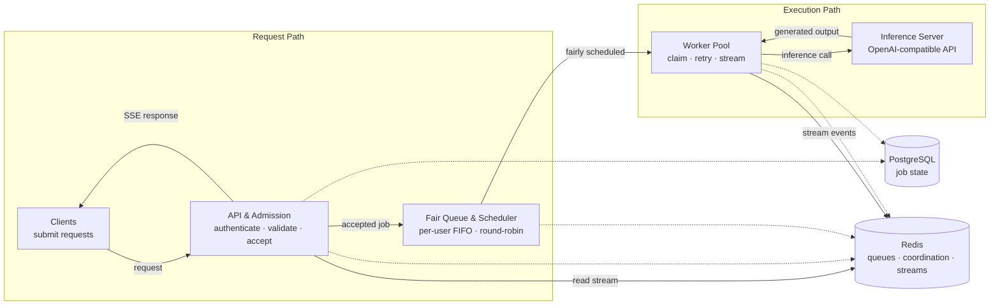

#  Efficient Request Queue for Self-Hosted LLM Inference

A request queue for managing authenticated client access to self-hosted LLM inference. It sits between clients and an OpenAI-compatible inference server, turning expensive inference work into a controlled and observable workflow with per-user scheduling fairness.

## Why fair scheduling matters for a self-hosted LLM

When an LLM is self-hosted, the scarce resource is often inference capacity, ultimately constrained by GPU resources. A naïve FIFO queue appears fair, but it is fair only to request arrival order: one user can submit many requests and occupy every worker while everyone else waits.

This queue makes the user—not the individual request—the scheduling unit. Each user gets a bounded FIFO queue, and the dispatcher rotates between users. A user with many waiting jobs gets service, but does not get ten consecutive turns while another user is waiting. That protects latency and makes shared inference capacity predictable without giving up FIFO ordering within a user’s own workload.

The design is intentionally conservative about expensive work: reject requests before GPU execution when policy, token cost, or queue capacity says they cannot be served; treat retries and repeated submissions as state-management problems; make worker ownership time-bounded; separate PostgreSQL’s durable job record from Redis’s fast coordination state; and make multi-key Redis scheduler transitions atomic.

## Architecture

The system is a modular monolith written in Go. Its modules have explicit boundaries around admission, jobs, scheduling, streaming, inference, recovery, and lifecycle management, while a single composition root wires the concrete implementations and infrastructure dependencies.



### Request and execution flow

1. An authenticated client submits a prompt, model, and required idempotency key.
2. The inference module validates the idempotency key and checks for an existing request. If the key already represents an in-flight request, the new submission is rejected. If the request has completed, its stored result is returned. An equivalent request detected by coalescing is also rejected while the original execution is in flight.
3. Admission validates and normalizes the request, loads the user’s tier policy, checks model and context limits, estimates input tokens, and applies the tier’s token-bucket rate limit to the request.
4. The job is created in PostgreSQL. The scheduler atomically places its ID into the user’s FIFO Redis list and activates that user if necessary.
5. A worker atomically claims the next active user using a Redis Lua operation. The operation removes one job, rotates the user if more work remains, and creates the processing lease in the same transition.
6. The worker fetches the request payload from PostgreSQL, calls the inference server, and retries when a recoverable failure occurs. It publishes output chunks to a Redis Stream, while the authenticated SSE endpoint reads and replays those events to the client.
7. If the worker encounters a recoverable inference failure, it retries according to policy. Non-recoverable failures or exhausted retries trigger the worker's terminal cleanup. If the worker dies or loses ownership before completion, the processing lease eventually expires and recovery requeues the job or marks it failed according to the retry policy, without allowing the stale worker to overwrite the new owner's state.
8. Terminal job state is persisted in PostgreSQL. Redis holds runtime coordination state such as queues, active users, processing leases, idempotency/coalescing state, and stream events, while recovery handles incomplete state transitions.

## Key design choices

### Rate limiting is based on token cost

The rate limiter is not a request counter and does not treat every request as having the same cost. Admission estimates input tokens from the prompt and determines the maximum output budget allowed by the user’s tier:

request cost = estimated input tokens + maximum output tokens

The Redis token-bucket state stores the current balance and the timestamp of the last calculation. A single Lua script atomically refills the bucket according to elapsed time, caps the balance, rejects a request whose cost can never fit, subtracts the full cost when possible, and persists the updated state with its TTL.

This means a request reserving a long completion consumes more admission budget than one reserving a short completion. Because refill and consumption happen atomically, concurrent requests cannot spend the same available balance twice.

The following values are illustrative configuration, not benchmark results:

| Tier    | Input limit (tokens) | Output budget (tokens) | Models                   | Capacity | Refill      |
|---------|---------------------:|-----------------------:|--------------------------|---------:|-------------|
| Free    | 1,000                | 100                    | `deepseek/deepseek-v3.2` | 2,000    | 10 tokens/s |
| Premium | 2,000                | 512                    | `qwen/qwen3.7-plus`        | 2,000    | 50 tokens/s |

The input estimate happens before queueing, so requests that exceed the configured input/context limits are rejected before a PostgreSQL job is created or execution capacity is consumed.

Current tradeoff: admission currently reserves the full maximum output budget rather than charging only for tokens actually generated. This is intentionally conservative: it makes admission deterministic and prevents overcommitment, but can penalize users whose requests consistently produce shorter completions. A later version can reconcile the reservation against actual usage after inference completes.

### Per-user queues and fair scheduling

Each user has a dedicated Redis List representing their pending jobs. The queue capacity is configurable and currently uses the same value across tiers for simplicity. The bound prevents a single user from accumulating an unbounded number of pending jobs and provides a clear rejection point when the queue reaches capacity.

New jobs are inserted at one end of the user’s queue and workers consume from the other, preserving FIFO ordering within each user's workload.

The scheduler maintains a Redis Sorted Set of active users. A user becomes active when their queue changes from empty to non-empty. The scheduler uses round-robin scheduling across active users: it selects the user with the lowest scheduling score, dequeues one job, and, if work remains, assigns the user a new score that places them at the back of the scheduling order. Users with empty queues are removed from the active set. The scheduling score uses a monotonic counter rather than a timestamp, providing deterministic ordering.

Three users have pending work:

```
User A: A1 → A2 → A3
User B: B1
User C: C1 → C2
```

The round-robin scheduler dispatches:

```
A1 → B1 → C1 → A2 → C2 → A3
```

This provides FIFO ordering within each user while preventing a user with many pending jobs from monopolizing worker capacity.

Current tradeoff: queue capacity is currently shared across tiers to keep the scheduling policy simple. A production deployment could assign different queue capacities to different tiers.

### Idempotency and request coalescing

Duplicate prevention protects GPU capacity from client retries, lost responses, and concurrent equivalent requests.

- **Idempotency keys** are user-scoped and give each submission a stable identity that can be used to detect duplicate submissions. The associated idempotency state distinguishes between in_flight, completed, and failed requests, allowing the system to decide whether to replay the existing request, reject it, or allow a new attempt.
- **Request coalescing** is also user-scoped. It detects equivalent requests from the same user that are already in flight, preventing that user from consuming additional inference capacity for duplicate work submitted concurrently.

Current tradeoff: a complete coalescing design would keep a leader request and attach equivalent requests as followers so that followers can receive the leader's result. The current implementation deliberately stops earlier: when equivalent in-flight work is detected, the new request is rejected rather than attached to the existing execution. This avoids duplicate inference work but does not yet provide result sharing for coalesced requests.

Current limitation: queue-level idempotency is not yet fully covered.

### Lease-based worker ownership

A worker claims a job by acquiring a time-limited processing lease stored in Redis. The worker sends periodic heartbeats to Redis to renew the lease while execution is in progress. If the worker dies, crashes, or can no longer renew its lease, the lease expires and the job becomes eligible for recovery.

If lease renewal fails, the worker stops acting as the owner and does not perform terminal cleanup that could overwrite state belonging to a new owner. Recovery is responsible for resolving the expired claim.

While the worker retains ownership, it handles the execution outcome: successful inference completes the job and publishes its terminal result, while a non-recoverable failure or exhausted retries marks the job as failed and publishes the corresponding terminal event. In both cases, the worker releases its processing state after completing the transition.

The key invariant is that only the current lease owner can perform terminal state changes. A stale worker cannot modify a job after ownership has moved to another worker.

```
PostgreSQL → durable job state
Redis      → runtime processing ownership / lease
Worker     → heartbeat + execution
Recovery   → expired lease handling
```

### Job recovery and state reconciliation

Recovery periodically handles three different classes of inconsistency in a fixed order:

1. **Expired processing leases** — find jobs whose processing lease has expired and verify that the claim is still expired before acting. If retries remain, the job is requeued and its retry count is incremented. If the retry limit has been reached, the job is removed from processing, marked failed, and a terminal failure event is published.
2. **Completed-marker reconciliation** — workers record completed jobs in Redis before the final PostgreSQL state transition. If a worker stops after recording completion but before finishing the PostgreSQL update, recovery uses the Redis completion marker to finish the job state, update idempotency state, close the event stream, and remove the completion marker.
3. **PostgreSQL orphan jobs** — find created jobs that are old enough to have passed the orphan grace period but were never queued in Redis. Recovery atomically enqueues them only if they are not already present in the scheduler state.

The ordering is intentional: completed jobs are reconciled before orphan jobs are swept. This prevents a job that finished execution but was not fully persisted from being mistaken for a job that was never queued.

Each recovery operation verifies the current Redis state before making changes, allowing recovery to run repeatedly without requeueing or completing the same job incorrectly.

### Atomic scheduler operations

The scheduler module owns the Redis state transitions for queueing, fair scheduling, processing leases, and recovery. Operations that modify multiple related Redis structures are implemented as atomic Lua transitions, so concurrent workers and recovery cannot observe or create partially applied scheduler state.

- **Enqueue** checks the user's queue capacity, reserves the idempotency key, adds the job to the user's FIFO queue, and activates the user when the queue was previously empty.
- **Dequeue and claim** select the active user with the lowest scheduling score, remove one job from that user's queue, rotate the user if more work remains, and create the job's processing lease in the same transition.
- **Lease extension** renews only an existing processing lease. The Redis ZADD XX operation prevents a heartbeat from recreating a lease after it has already been removed.
- **Expired recovery** verifies that the job is still present with an expired processing lease before removing or requeueing it. This prevents a stale recovery pass from interfering with a newer owner.
- **Orphan enqueue** checks whether the job is already completed, processing, or present in the user's queue before restoring it. It also enforces queue capacity and activates the user when the queue was previously empty.

The purpose of these Lua transitions is correctness, not simply reducing Redis round trips. Related changes to queues, active users, processing leases, and recovery state happen as a single atomic transition, preventing concurrent operations from leaving the scheduler in a partially updated state.

### Graceful lifecycle management

Startup follows module dependency order, with already-started modules rolled back if a later startup step fails. Shutdown runs in reverse order and attempts to stop all components even when one stop operation returns an error.

Workers have an explicit shutdown lifecycle: shutdown stops claiming new jobs and waits for in-progress work to finish within the configured shutdown budget. Once a job has been claimed, its execution context is independent of the worker lifecycle, allowing heartbeat and terminal cleanup to continue according to the job's ownership state rather than being cancelled immediately by worker shutdown.

Terminal cleanup uses cancellation-independent contexts with bounded deadlines, so a worker can complete necessary cleanup after execution cancellation while still respecting a finite shutdown window.

## Data ownership

| Store                        | Owns                                                                    | Why                                                    |
| ---------------------------- | ----------------------------------------------------------------------- | ------------------------------------------------------ |
| PostgreSQL                   | users, OAuth accounts, jobs, requests, durable job status, retry state  | durable source of record and transactional persistence |
| Redis Lists/Sets/Sorted Sets | per-user queues, active users, processing leases, completion markers    | low-latency scheduler and worker coordination          |
| Redis Hashes/Strings         | rate-limit state, idempotency, coalescing, OAuth state, user-tier cache | atomic coordination and short-lived application state  |
| Redis Streams                | inference chunks, retry events, and completed/failed terminal events    | replayable delivery between workers and SSE clients    |

PostgreSQL is the durable source of record for job persistence and terminal state. Redis holds runtime coordination state required for scheduling, worker ownership, admission, and streaming.

Redis uses `volatile-lru`: intentionally ephemeral keys carry TTLs and form the eviction pool, while scheduler and ownership state that must remain available for recovery is kept without TTL.

### Job state management

The job lifecycle is split between durable PostgreSQL state and runtime Redis ownership:

```text
PostgreSQL:

created --> completed | failed
```

PostgreSQL records the durable job lifecycle and terminal outcome. Redis tracks whether a job is queued or currently owned by a worker through its processing lease.

A job can therefore temporarily have durable PostgreSQL state created while its runtime scheduling state is queued or processing in Redis.

Current tradeoff: PostgreSQL intentionally does not persist a processing state. Processing is a transient ownership condition represented by the Redis processing lease. Keeping this state in Redis avoids high-frequency PostgreSQL updates for job claims, lease renewal, and recovery, while allowing PostgreSQL to remain focused on durable job state and terminal outcomes.

A valid processing lease is therefore the runtime source of truth for worker ownership. If the lease expires, recovery can determine that the previous ownership is no longer valid without relying on a potentially stale database state.

Job state and idempotency state are separate concerns. Job state describes **execution**, while idempotency state (`in_flight`, `completed`, `failed`) describes the **submission represented by an idempotency key**.

## Correctness and invariants

The focused test suite is organized around **system invariants**, rather than individual implementation functions. Coverage spans unit, integration, and concurrency tests across admission, durable job state, fair scheduling, worker execution, streaming, and failure recovery.

### Admission

The tests cover:

* validation and rejection before downstream work or job creation;
* tier-specific model, token, and output policies;
* per-user rate-limit isolation;
* concurrent rate-limit consumption without exceeding configured capacity;
* fail-closed behavior when rate-limit infrastructure is unavailable.

### Job state

The tests cover:

* transactional job creation without partial persistence;
* valid terminal state transitions;
* rejection of invalid terminal transitions without changing existing state;
* conditional retry updates;
* concurrent conditional updates producing a single consistent result.

### Scheduling

The tests cover:

* FIFO ordering within each user's queue;
* round-robin scheduling across active users;
* preventing one user from monopolizing the scheduler while other users have pending work;
* removal of empty users from the active set;
* reactivation of users when new work is queued;
* concurrent claims without duplicate job ownership.

### Worker execution

The tests cover:

* successful execution and terminal completion events;
* non-retryable inference failures;
* retry behavior for transient failures;
* retry exhaustion and terminal failure;
* concurrent worker claim uniqueness;
* ordered replay of published inference events.

### Recovery

The tests cover:

* recovery of expired processing leases according to retry policy;
* protection of live leases from recovery;
* reconciliation of interrupted completion transitions;
* preventing completed work from being treated as an orphan;
* restoration of genuine orphan jobs to the scheduler;
* protection against duplicate enqueue during orphan recovery;
* concurrent recovery of the same expired job.

The complete scenario matrix, coverage levels, test-environment details, known limitations, and current validation status are maintained in the test invariant document.

Note: These tests cover functional, state-transition, coordination, and concurrency behavior for the scenarios listed above. They do not measure throughput, latency under load, scalability, GPU/inference performance, production recovery time, Redis/PostgreSQL capacity, horizontal scalability, or production readiness.

## API

| Method | Endpoint                         | Purpose                                       |
| ------ | -------------------------------- | --------------------------------------------- |
| `POST` | `/api/request`                   | Submit an authenticated inference request     |
| `GET`  | `/api/stream/:jobID`             | Consume authenticated inference output as SSE |
| `GET`  | `/api/auth/login/github`         | Start GitHub OAuth                            |
| `GET`  | `/api/auth/github/callback`      | Complete GitHub OAuth                         |
| `POST` | `/api/admin/register`            | Register an administrator                     |
| `POST` | `/api/admin/login`               | Authenticate an administrator                 |
| `PUT`  | `/api/admin/users/:user_id/tier` | Change a user's tier                          |
| `GET`  | `/api/health/live`               | Liveness probe                                |
| `GET`  | `/api/health/ready`              | PostgreSQL and Redis readiness probe          |

## Configuration and local run

### Prerequisites
* Go 1.25.7 or newer
* Docker Engine and Docker Compose
* Make
* `goose` for PostgreSQL migrations
* Git
* An OpenAI-compatible inference server
* GitHub OAuth credentials for testing login

### How to run
#### Local Go execution

Start infrastructure:
```
make dev_up
make migrate_up
make run
```

Build locally with:
```
make build
```

#### Full Docker stack

```
make docker_up
```

Stop it with:
```
make docker_down
```

The stack includes PostgreSQL, Redis, Vector, and VictoriaLogs.

Services:

```
App: localhost:8080
Redis: localhost:6379
RedisInsight: localhost:8001
VictoriaLogs: localhost:9428
Prometheus: localhost:9090
Grafana: localhost:3000
```

Logging: the application writes structured logs to stdout. Vector collects the container logs and forwards them to VictoriaLogs for centralized querying.

When running locally, PostgreSQL and Redis configuration should use localhost. When running inside Docker, use the Compose service names (postgres, redis-stack).

#### Development commands

```
make lint
make test_all
make test_integration
make migrate_down
make dev_down
```

## Scope

The project does not implement or deploy an LLM inference engine. It treats the inference server as an external OpenAI-compatible dependency configured through a base URL.

## TODO

* [ ] Add and validate Prometheus metrics.
* [ ] Add load tests.
* [ ] Measure throughput, p95/p99 latency, queue behavior, duplicate execution, and recovery behavior under load.
* [ ] Document reproducible load-test results and test environment.
* [ ] Improve test-code organization and reduce duplicated integration/concurrency test setup.
* [ ] Add load-shedding behavior based on queue pressure and system capacity.
