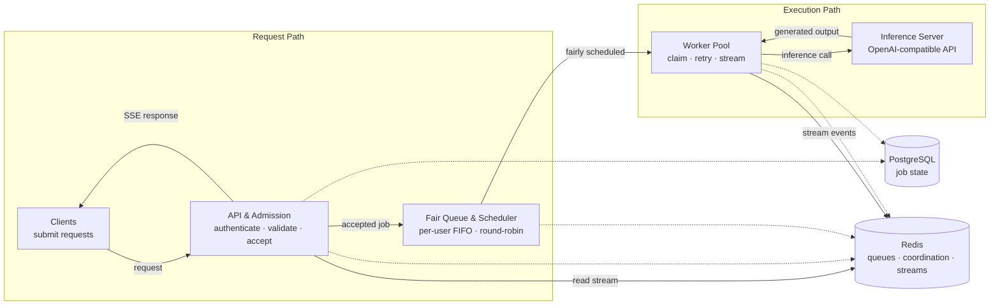

# Table of Contents

- [Efficient Request Queue](#efficient-request-queue)
  - [Why fair scheduling matters for a self-hosted LLM](#why-fair-scheduling-matters-for-a-self-hosted-llm)
  - [Architecture](#architecture)
    - [Request and execution flow](#request-and-execution-flow)
  - [Engineering decisions](#engineering-decisions)
    - [Token-based rate limiting counts inference cost](#token-based-rate-limiting-counts-inference-cost)
    - [Per-user queue size and fair dispatch](#per-user-queue-size-and-fair-dispatch)
    - [Duplicate-work protection: idempotency and coalescing](#duplicate-work-protection-idempotency-and-coalescing)
    - [Lease ownership, heartbeats, and failure cleanup](#lease-ownership-heartbeats-and-failure-cleanup)
    - [Three distinct recovery paths](#three-distinct-recovery-paths)
    - [Atomic scheduler operations](#atomic-scheduler-operations)
    - [Graceful lifecycle management](#graceful-lifecycle-management)
    - [Data ownership](#data-ownership)
      - [Job state management](#job-state-management)
  - [Correctness and invariants](#correctness-and-invariants)
    - [Admission](#admission)
    - [Job state](#job-state)
    - [Scheduling](#scheduling)
    - [Worker execution](#worker-execution)
    - [Recovery](#recovery)
  - [API](#api)
  - [Configuration and local run](#configuration-and-local-run)
    - [Prerequisites](#prerequisites)
  - [Development commands](#development-commands)
  - [Project layout](#project-layout)
  - [License](#license)

# Efficient Request Queue 

A request queue for managing authenticated client access to self-hosted LLM inference. It sits between clients and an OpenAI-compatible inference server, turning expensive inference work into a controlled and observable workflow with per-user scheduling fairness.

## Why fair scheduling matters for a self-hosted LLM

When an LLM is self-hosted, the scarce resource is often inference capacity, ultimately constrained by GPU resources. A naïve FIFO queue appears fair, but it is fair only to request arrival order: one user can submit many requests and occupy every worker while everyone else waits.

This queue makes the user—not the individual request—the scheduling unit. Each user gets a bounded FIFO queue, and the dispatcher rotates between users. A user with many waiting jobs gets service, but does not get ten consecutive turns while another user is waiting. That protects latency and makes shared inference capacity predictable without giving up FIFO ordering within a user’s own workload.

The design is intentionally conservative about expensive work: reject requests before GPU execution when policy, token cost, or queue capacity says they cannot be served; treat retries and repeated submissions as state-management problems; make worker ownership time-bounded; separate PostgreSQL’s durable job record from Redis’s fast coordination state; and make multi-key Redis scheduler transitions atomic.

## Architecture

The system is a modular monolith written in Go and Gin. Its modules have explicit boundaries around admission, jobs, scheduling, streaming, inference, recovery, and lifecycle management, while a single composition root wires the concrete infrastructure.



### Request and execution flow

1. An authenticated client submits a prompt, model, and required idempotency key.
2. The inference module validates the idempotency key and checks for an existing request. A matching idempotency key replays the existing request or result; an equivalent in-flight request detected by coalescing is rejected.
3. Admission validates and normalizes the request, loads the user’s tier policy, checks model and context limits, estimates input tokens, and applies the tier’s token-bucket rate limit against the request’s token budget.
4. The job is created in PostgreSQL. The scheduler atomically places its ID into the user’s FIFO Redis list and activates that user if necessary.
5. A worker claims the next active user through the round-robin script. The claim removes one job, rotates the user if more work remains, and creates a processing lease in the same operation.
6. The worker loads the durable payload, calls the inference server with retries, publishes output chunks to a Redis Stream, and the authenticated SSE endpoint reads and replays those events to the client.
7. If a worker loses ownership or fails before completion, lease expiry makes the job eligible for recovery. Recovery restores the job to schedulable state without allowing a stale worker to overwrite the new owner’s result.
8. Terminal job state is persisted in PostgreSQL. Redis holds runtime coordination state such as queues, active users, processing leases, idempotency/coalescing state, and stream events, with completion reconciled across the relevant state transitions.

## Engineering decisions

### Token-based rate limiting counts inference cost

The rate limiter is not a request counter and does not treat every request as having the same cost. Admission estimates input tokens from the prompt and determines the maximum output budget allowed by the user’s tier:

request cost = estimated input tokens + maximum output tokens

The Redis token-bucket state stores the current balance and the timestamp of the last calculation. A single Lua script atomically refills the bucket according to elapsed time, caps the balance, rejects a request whose cost can never fit, subtracts the full cost when possible, and persists the updated state with its TTL.

This means a request reserving a long completion consumes more admission budget than one reserving a short completion. Because refill and consumption happen atomically, concurrent requests cannot spend the same available balance twice.

The following values are illustrative configuration, not benchmark results:

| Tier    | Input limit (tokens) | Output budget (tokens) | Models                   | Capacity | Refill      |
|---------|---------------------:|-----------------------:|--------------------------|---------:|-------------|
| Free    | 1,000                | 100                    | `deepseek/deepseek-v3.2` | 2,000    | 10 tokens/s |
| Premium | 2,000                | 512                    | `qwen3.7`                | 2,000    | 50 tokens/s |

The input estimate happens before queueing, so requests that exceed the configured input/context limits are rejected before a PostgreSQL job is created or execution capacity is consumed.

Current tradeoff: admission currently reserves the full maximum output budget rather than charging only for tokens actually generated. This is intentionally conservative: it makes admission deterministic and prevents overcommitment, but can penalize users whose requests consistently produce shorter completions. A later version can reconcile the reservation against actual usage after inference completes

### Per-user queue size and fair dispatch

Each user has a dedicated Redis List representing their pending jobs. The queue capacity is configurable and currently uses the same value across tiers for simplicity. The bound prevents a single user from creating an unbounded backlog while providing a clear rejection point when their pending work exceeds the configured capacity.

New jobs are inserted at one end of the user’s queue and workers consume from the other, preserving FIFO ordering within each user's workload.

The scheduler maintains a Redis Sorted Set of active users. A user becomes active when their queue changes from empty to non-empty. The scheduler implements round-robin dispatch across active users: it selects the user with the lowest scheduling score, dequeues one job, and, if work remains, assigns the user a new score that places them at the back of the scheduling order. Users with empty queues are removed from the active set.

Three users have pending work:

```
User A: A1 → A2 → A3
User B: B1
User C: C1 → C2
```
The round-robin scheduler dispatches:

```
A1 → B1 → C1 → A2 → C2 → A3
```

This provides FIFO ordering within each user while preventing a user with many pending jobs from monopolizing worker capacity.

Current tradeoff: queue capacity is currently shared across tiers to keep the scheduling policy simple. A production deployment could assign different queue capacities to different tiers based on their resource entitlements and expected workload.

### Duplicate-work protection: idempotency and coalescing

Duplicate prevention protects GPU capacity from client retries, lost responses, and concurrent equivalent requests.

- **Idempotency keys** are user-scoped and allow the system to recognize repeated submissions of the same request. The associated idempotency state distinguishes between in_flight, completed, and failed requests, allowing the system to decide whether to replay the existing request or result, or allow a new attempt.
- **Request coalescing** is also user-scoped. It detects equivalent requests from the same user that are already in flight, preventing that user from consuming additional inference capacity for duplicate work submitted concurrently.

Current tradeoff: a complete coalescing design would keep a leader request and attach equivalent requests as followers so that followers can receive the leader's result. The current implementation deliberately stops earlier: when equivalent in-flight work is detected, the new request is rejected rather than attached to the existing execution. This avoids duplicate inference work but does not yet provide result sharing for coalesced requests.

Current limitation: queue-level idempotency is not yet fully covered. 

### Lease ownership, heartbeats, and failure cleanup

A worker claim is a lease, not a permanent lock. The current configuration uses a 60-second lease with heartbeats every 20 seconds, giving the system a bounded window to detect abandoned ownership. These values are configuration, not a measured recovery-time guarantee.

Cleanup is ownership-sensitive:

Successful inference records the terminal completion state, reconciles the durable PostgreSQL job state, transitions idempotency state, closes the stream, and releases processing state.
Exhausted or non-recoverable failure marks the job failed, transitions idempotency state, releases processing state, and publishes a terminal failed event.
Compensation and terminal cleanup use bounded cancellation-independent contexts so required state cleanup can proceed even when the original request context has been cancelled.
Lease loss changes the worker's authority. If heartbeat renewal fails, the worker stops acting as the owner and skips cleanup that could overwrite state belonging to a replacement worker. Recovery is responsible for resolving the expired claim.

The critical invariant is that lease ownership determines who is authorized to perform terminal cleanup. An old worker observing an error is not sufficient authority to mutate state after ownership has moved to another worker.

### Three distinct recovery paths

Recovery periodically handles three different classes of inconsistency in a fixed order:

1. **Expired processing leases** — atomically verify that the processing claim is still expired, then increment retry state and requeue the job, or mark it failed and publish a terminal event when retries are exhausted.
2. **Completed-marker reconciliation** — workers write a durable Redis completion marker before final PostgreSQL completion. If a worker stops between these operations, recovery uses the marker to complete the job record and idempotency state and reconcile the remaining terminal state.
3. **PostgreSQL orphan jobs** — find old created jobs that never reached Redis, subject to a grace period, and atomically enqueue them only if they are not already completed, processing, or queued.

The ordering is intentional: completed work is reconciled before orphan sweeping so a job that finished execution but was not fully reconciled is not mistaken for work that was never scheduled.

Recovery is designed to be repeatable. Redis-side state checks and atomic transitions prevent repeated recovery passes from requeueing, completing, or cleaning up the same job incorrectly.

### Atomic scheduler operations

Redis acts as a coordination engine for scheduler state. Operations that modify multiple related structures are implemented as atomic Lua transitions so workers and recovery cannot observe or create partially applied state changes.

- **Enqueue** checks queue capacity, appends the job, and activates the user when the queue transitions from empty to non-empty.
- **Dequeue** selects the next active user, removes one job, rotates or removes the user depending on remaining work, and creates the processing lease as one atomic transition.
- **Lease extension** can extend only an existing processing claim. Using ZADD XX prevents a heartbeat from recreating a lease after ownership has already been released.
- **Expired requeue/removal** verifies that the job is still associated with the expired claim before changing its state, preventing stale recovery from interfering with a newer owner.
- **Orphan enqueue** checks the job's current state, enforces queue capacity, and restores the user's active scheduling state in one operation.

Scripts use Redis server time for scheduling scores and lease deadlines, avoiding dependence on synchronized application clocks.

The goal is not simply fewer Redis round trips. The important property is that related scheduler state changes happen as a single transition, so enqueue, dispatch, lease ownership, and recovery cannot leave behind partially applied state.

### Graceful lifecycle management

Workers have an explicit shutdown lifecycle: shutdown stops new work, waits for in-progress workers to finish within the configured shutdown budget, and separates worker lifecycle cancellation from per-job and heartbeat contexts. This allows a worker to stop renewing ownership while still performing bounded terminal cleanup when it remains the lease owner.

Recovery and stream consumers also have explicit shutdown behavior.

### Data ownership

| Store                        | Owns                                                                    | Why                                                    |
| ---------------------------- | ----------------------------------------------------------------------- | ------------------------------------------------------ |
| PostgreSQL                   | users, OAuth accounts, jobs, requests, durable job status, retry state  | durable source of record and transactional persistence |
| Redis Lists/Sets/Sorted Sets | per-user queues, active users, processing leases, completion markers    | low-latency scheduler and worker coordination          |
| Redis Hashes/Strings         | rate-limit state, idempotency, coalescing, OAuth state, user-tier cache | atomic coordination and short-lived application state  |
| Redis Streams                | inference chunks, retry events, and completed/failed terminal events    | replayable delivery between workers and SSE clients    |

PostgreSQL is the durable source of record for job persistence and terminal state. Redis holds runtime coordination state required for scheduling, worker ownership, admission, and streaming.

Redis uses `volatile-lru`: intentionally ephemeral keys carry TTLs and form the eviction pool, while scheduler and ownership state that must remain available for recovery is kept without TTL.

#### Job state management

The job lifecycle is split between durable PostgreSQL state and runtime Redis ownership:

```text
PostgreSQL:

created ───────────────→ completed
   │
   └────────────────────→ failed

```

PostgreSQL records the durable job lifecycle and terminal outcome. Redis tracks whether a job is queued or currently owned by a worker through its processing lease.

A job can therefore temporarily have durable PostgreSQL state such as `created` while its runtime scheduling state is `processing` in Redis.

Job state and idempotency state are separate concerns. Job state describes **execution**, while idempotency state (`in_flight`, `completed`, `failed`) describes the **submission represented by an idempotency key**.

## Correctness and invariants

The test suite is organized around **system invariants**, rather than individual implementation functions. The focused tests cover admission, durable job state, fair scheduling, worker ownership, streaming, and failure recovery.

### Admission

Tests verify that:

* invalid requests are rejected before downstream work or job creation;
* tier-specific model, token, and output policies are applied correctly;
* rate-limit consumption is isolated per user;
* concurrent requests cannot overspend the configured token capacity;
* rate-limit infrastructure failures fail closed.

### Job state

Tests verify that:

* job creation is transactional and does not leave partial state;
* valid terminal transitions persist the expected state;
* invalid terminal transitions are rejected without changing existing state;
* concurrent conditional updates produce a single consistent winner.

### Scheduling

Tests verify that:

* each user's queue preserves FIFO ordering;
* active users are served using round-robin scheduling;
* one user cannot monopolize the scheduler while other users have pending work;
* empty users are removed from the active set;
* concurrent claims cannot return the same job twice.

### Worker execution

Tests verify that:

* successful execution produces exactly one terminal completion event;
* permanent failures are not retried;
* transient failures retry according to policy;
* retry exhaustion produces exactly one terminal failure;
* concurrent workers cannot claim the same job;
* published inference events can be replayed in order.

### Recovery

Tests verify that:

* expired processing leases are requeued or failed according to retry policy;
* live leases are not incorrectly recovered;
* completion markers reconcile interrupted terminal transitions;
* completed work is not mistaken for an orphan job;
* genuine orphan jobs can be restored to the scheduler;
* concurrent recovery of the same expired job produces one consistent result.

The complete scenario matrix, test-environment details, known limitations, and execution targets are maintained in the [test invariant document](docs/testing/invariants.md).

These tests establish **functional, state-transition, coordination, and concurrency correctness**. They do **not** establish throughput, latency under load, scalability, GPU performance, production recovery time, or production readiness. Those properties are evaluated separately through load and stress testing.

## API

| Method | Endpoint | Purpose |
| --- | --- | --- |
| `POST` | `/api/request` | Submit an authenticated inference request |
| `GET` | `/api/stream/:jobID` | Consume authenticated inference output as SSE |
| `GET` | `/api/auth/login/github` | Start GitHub OAuth |
| `GET` | `/api/auth/github/callback` | Complete GitHub OAuth |
| `POST` | `/api/admin/register` | Register an administrator |
| `POST` | `/api/admin/login` | Authenticate an administrator |
| `PUT` | `/api/admin/users/:user_id/tier` | Change a user’s tier |
| `GET` | `/api/health/live` | Liveness probe |
| `GET` | `/api/health/ready` | PostgreSQL and Redis readiness probe |

Example submission:

```bash
curl -X POST http://localhost:8080/api/request \
  -H "Authorization: Bearer $USER_TOKEN" \
  -H "Idempotency-Key: example-request-1" \
  -H "Content-Type: application/json" \
  -d '{"prompt":"Explain fair scheduling in one sentence.","model":"deepseek/deepseek-v3.2"}'
```

```bash
curl -N http://localhost:8080/api/stream/$JOB_ID \
  -H "Authorization: Bearer $USER_TOKEN"
```

## Configuration and local run

### Prerequisites

- Go 1.25.7 or newer
- Docker and Docker Compose
- `goose` for migrations
- An OpenAI-compatible inference server, such as vLLM
- GitHub OAuth credentials for testing login

```bash
make up
make migrate_up
make run
```

Supporting services are exposed at PostgreSQL `:5432`, Redis `:6379`, RedisInsight `:8001`, Prometheus `:9090`, and Grafana `:3000`. Configuration is loaded from `configs/` and can be overridden with `CFG_PATH`; secrets belong in `.env` and should not be committed.

## Development commands

```bash
go test ./...
go vet ./...
make lint
make migrate_down
make down
```

The integration suite uses Redis DB 15 and requires the Redis Stack service from
`make up` to be running. It isolates and flushes its test database, and refuses
to run against Redis DB 0.

```bash
make test_integration
```

Integration coverage includes admission control, fair scheduling and recovery,
worker claim/retry/cleanup behavior, concurrent workers, and Redis stream
replay. The worker scenario boundaries are documented in
`tests/integration/worker_integration_scenarios.md`.

## Project layout

```text
cmd/                  Application entrypoint
configs/              YAML configuration
docs/                 System design and API/Postman documentation
infra/                Docker Compose and observability configuration
internal/application/ Composition root and module registry
internal/<module>/    Domain modules, ports, adapters, and transports
migrations/           PostgreSQL migrations
```

## License

No license has been declared yet.